```{r, include=FALSE}
knitr::opts_chunk$set(echo = FALSE)

# bookdown::render_book("index.Rmd", "bookdown::pdf_book")
# Run the previous command and...
# Uncomment this line to build pdf version of manual:
# knitr::opts_chunk$set(echo = FALSE, out.width = "100%")
```

# Introduction

The Cycling Infrastructure Prioritisation Toolkit (CyIPT) is a research project based at the University of Leeds and funded by the Department for Transport (DfT).  The purpose of CyIPT is to develop methods and tools to assist in the design and planning of new cycling infrastructure.  CyIPT is currently (as of March 2018) a working prototype.  Therefore, any recommendations produced by CyIPT should be subjected to independent assessment before making investment decisions.

## Feedback {-}

CyIPT is a publicly accessible research project based on open source software, the results of which are available in an online map-based tool at [www.cyipt.bike](https://www.cyipt.bike) (currently password protected).

The code underlying CyIPT is hosted on GitHub, a platform for software development and collaboration that also provides and excellent forum for discussing issues and providing feedback as follows:

- Feedback on CyIPT Results and Methods: [github.com/cyipt/cyipt/issues](https://github.com/cyipt/cyipt/issues) 
- Feedback on CyIPT website and user interface: [github.com/cyipt/cyipt-website](https://github.com/cyipt/cyipt-website/issues)

Hosting the code on GitHub also enables community contributions.
If you find any issues on this user manual, for example, suggested changes to the source code are welcome [here](https://github.com/cyipt/cyipt-website/edit/master/man/index.Rmd), which requires a GitHub username from [github.com](https://github.com/).

Alternatively we welcome your feedback at info@cyipt.bike.

## The CyIPT Team {-}

- Dr Robin Lovelace, University of Leeds
- Dr Malcolm Morgan, University of Leeds
- Prof John Parkin, University of the West of England
- Martin Lucas-Smith, CycleStreets.net

```{r}

```

# How CyIPT works

This section gives an overview of how CyIPT works and some of its main limitations.  For full details, see the Technical Details section below.

Figure \@ref(fig:workflow) outlines the basic structure of CyIPT. First CyIPT takes data about each road and path in England and uses it to recommend the approximate type of cycling infrastructure.  The recommendation algorithm is based on Highways England’s Interim Advice Note 195/16 [@highwaysengland_interim_2016]. The algorithm can make eight possible recommendations (Cycle Lanes, Cycle Lanes with light segregation, Cycle Street, Cycle Land on Path, Stepped Cycle Tracks, Segregated Cycle Track on Path, Segregated Cycle Track, and None).

```{r workflow, fig.cap="Schematic overview of CyIPT."}
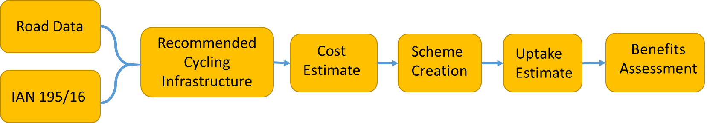
```

Based on the length and type of infrastructure, CyIPT estimate the cost of constructing the recommended new cycling infrastructure.  CyIPT take account of existing infrastructure and therefore does not apply a cost of building existing cycle infrastructure if it is of sufficient quality. 

As CyIPT’s recommendations are made for each road segment (junction to junction), they can be for very short sections of road. Therefore, CyIPT has a clustering algorithm, which attempts to take recommendations and group them into coherent schemes that could be constructed. One the schemes have been produced, CyITP estimate the number of additional cyclists the scheme would produce and performed a benefit cost assessment of the schemes to identify the schemes which are most likely to be worth building.
The CyIPT process is deterministic, which is to say that it produces the same results each time the model is run, and has therefore been pre-processed by the CyIPT team.  The results for England are made available through the CyIPT website (www.cyipt.bike).  The CyIPT website also allows for data download and the source code is available at GitHub (https://github.com/cyipt).

# Key concepts

## Accuracy

While using CyIPT it is important to bear in mind that:

- It was funded under the Innovation Challenge Fund (ICF) and at present should be regarded as a proof of concept prototype demonstrating what is possible.
- As CyIPT is a national tool, it uses national datasets which may be less detailed and up-to-date, than local data sources.
- As CyIPT is a national tool, it has probably had limited human oversight in your area.  Results have been 'sanity checked' for some areas but we are unable to check if every road in the country has sane results (please report on our [issue tracker](https://github.com/cyipt/cyipt/issues) if not).
- CyIPT relies on the OpenStreetMap (OSM), the quality of which varies across the country.
- Currently the results are based on commuter cycling only, meaning other data sources and local knowledge must be used to account for other trip purposes (e.g. recreational cycling, travel to schools, shops). We hope to add travel to school and public transport links in due course.
- The results do not take account of the wider transport and political context.

While CyIPT provides detailed numbers such as costs and cycling uptake, it is best views as a tool to draw your attention to specific areas that may benefit from improved cycling infrastructure, rather than an automatic transport planner.

The layers in CyIPT are intended to provide insight into various geographic factors that should inform the decision-making process. For example the traffic counts layer has many roads without any traffic data.  This does not mean there is no traffic on these roads.  It simply means that CyIPT does not know about the traffic on these roads, and its recommendations will be affected by this lack of knowledge. 

Users should evaluate each recommendation independently, scrutinising how CyIPT came to its conclusion and validating those assumptions.

## Open Street Map

CyIPT uses the Open Street Map (https://www.openstreetmap.org/#map=6/54.910/-3.432) to provide the base road and path map of England. CyIPT uses OSM for several reasons:
OSM’s open licence allows free use and reuse of all the data;
National coverage;
OSM has more detail about cycling infrastructure than some official sources.

However OSM has several limitations, firstly as a crowd sourced dataset the accuracy and detail of OSM is variable.  While OSM covers over 99% of the roads in the UK, details such as rad types, speed limits, cycle infrastructure, etc. are far patchier.  CyIPT has a built in OSM cleaner that attempts to remove errors and fill in missing data.  For example, CyIPT will assume that the speed limit on a residential road is 30 mph unless otherwise specified.

CyIPT users can improve CyIPT results in their area by updating OSM.  The Existing Infrastructure Layer (see below) has a “Edit OSM” button that links directly from any road in CyIPT to the same road in OSM. Updates to OSM are incorporated into CyIPT when the next national rebuild occurs.

## Cycling Flows from the PCT

CyIPT Uses the Propensity to Cycle Tool (PCT www.pct.bike) to provide data on the existing and future cycling flows on each road.  This data is in turn taken from the 2011 census commuting flow data.  Therefore:

- CyIPT is biased towards commuter cycling due to using the PCT data.
- CyIPT has a 2011 view of travel patterns but for existing travel and as a baseline for predicting future demand.

National cycling and travel trends have not changed significantly between 2011 and the present day, however, in local areas travel patterns have changed due to new cycle infrastructure and new housing.  Users should apply extra scrutiny to CyIPT results in areas where there have been significant changes since 2011.

## Rate Limiting

To maintain the performance of the CyIPT website, the map data is rate limited.  These limits will prevent you from downloading too much data at once.  You are most likely to encounter rate limiting when attempting to view large areas. When rate limiting occurs, the data will appear on the map in a patchy or random fashion, as illustrated in Figure \@ref(fig:ratelim).

```{r ratelim, fig.cap="Example of the map of London when rate limited is in effect."}
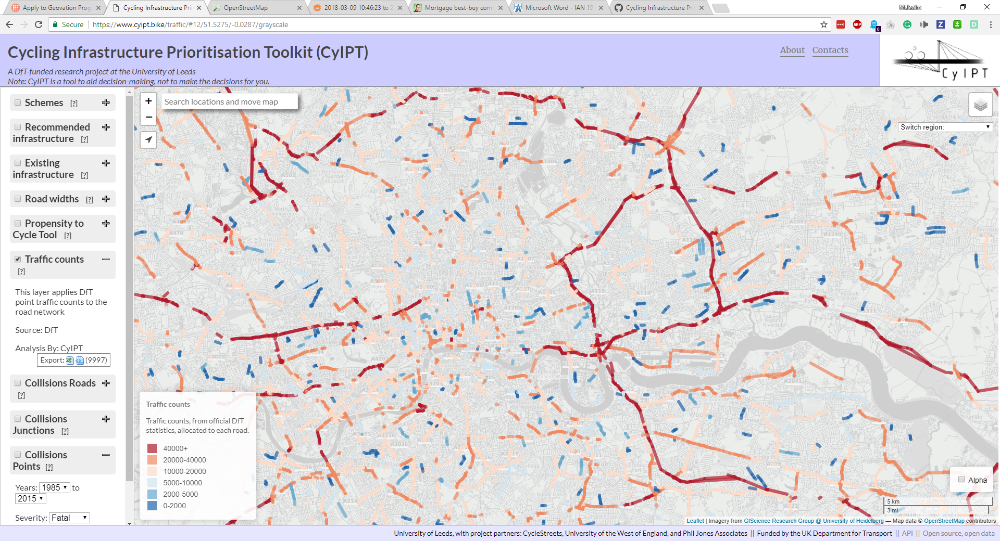
```

For some layers now data will show until you are zoomed in to a certain level.  While some layers (e.g. Propensity to Cycle Tool layer) provide more detail the further you zoom in.

## Geometry Simplification

To allow you to view the results of CyIPT over larger areas, the CyIPT website simplifies the geometry of the roads when zoomed out.  This simplification can be noticeable when zooming, resulting in curved lines becoming straight.  The simplification process is performed after the analysis has been completed, and therefore does not affect the results.

```{r simp, fig.cap="Example of geometric simplification when zoomed out (left) and full detail when zoomed in (right)."}
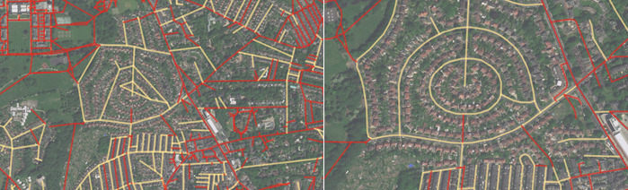
```

# Layer descriptions

The CyIPT website is an interactive map presenting a range of different  layers.

## Existing infrastructure

The Existing Infrastructure layer has three modes (Cycle infrastructure, Speed limits, Footways).  These modes are intended to help the users understand the current level of provision for active modes, and can be selected using the dropdown menu illustrated in Figure \@ref(fig:existing-dropdown).

```{r existing-dropdown, fig.cap="Dropdown menu illustrating available modes in the existing infrastructure layer."}
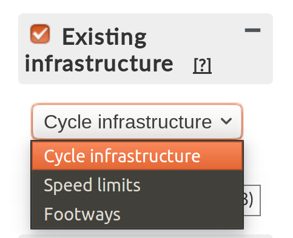
```

For each mode, the underlying data is taken from the Open Street Map (OSM), which is then passed through a cleaning process to correct errors and fill in any missing data.

If any values are incorrect in CyIPT (for example an incorrect speed limit) clicking on the road will show a popup including an "Edit in OSM" button.  This button will take you to the same road in the OSM website where you can make corrections.  These corrections (and any other updates) will be incorporated into CyIPT next time the data is rebuilt.

### Cycle infrastructure

The cycle infrastructure mode shows physical cycling infrastructure such as cycle lanes and tracks (Figure \@ref(fig:existing-cycling). It does not show signposted cycle routes (e.g. national cycle network) where there is no physical infrastructure.

```{r existing-cycling, fig.cap="The 'Cycle infrastructure' mode in the Existing infrastructure layer."}
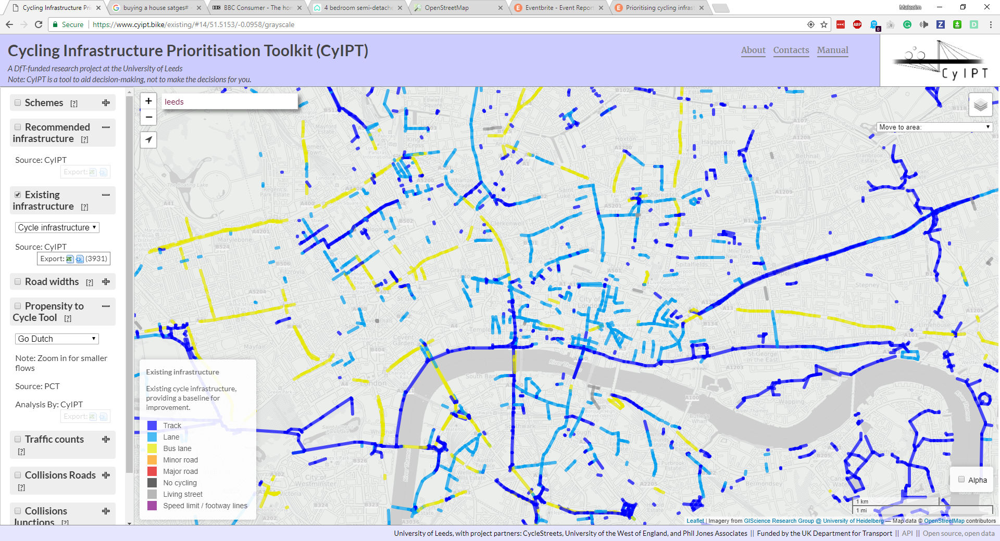
```

This layer shows what CyIPT will consider existing infrastructure when calculating the costs of new/upgraded cycle infrastructure.

## Speed limits

The speed limits mode shows the maximum speed limit in miles per hour.

<!-- todo: add images here and below -->

## Footways

The footways mode shows the presence of footways (pavements) on the side of the road.

## Schemes

The Schemes and presents the results of the toolkit for route segments, divided-up into geographically cohesive entities (see Figure \@ref(fig:schemes).
Schemes can be composed of a variety of interventions, which can be:

- A recommendation for new/upgraded cycle infrastructure, or
- Multiple infrastructure types (only the most common is named)

```{r schemes, fig.cap="The Schemes layer"}
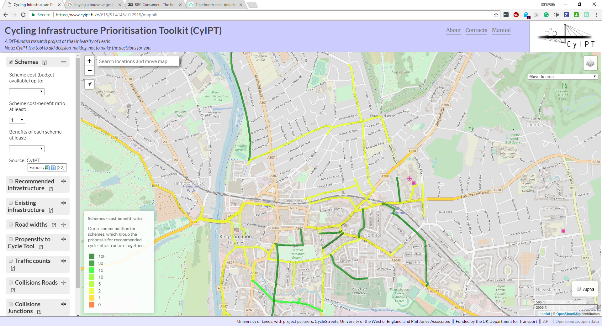
```

Schemes covers a defined area providing a route or part of a network.
Each scheme is derived from the recommended infrastructure layer (see below) by excluding any roads where the recommended level of cycle infrastructure is equal to or exceeded by the existing infrastructure.  Recommendations are then grouped into schemes, to convert recommendations that may only be a few tens of metres into a coherent route or network. Schemes below a threshold length are then excluded.

<!-- Todo: automate the process of adding this paramet (where is it in the code?) -->

This final list of schemes is evaluated by estimating the increase in cycling due to the new infrastructure and a range of benefits derived from increase cycling.  The benefits categories within CyIPT are:

- Health benefits from increase exercise
- Benefits from reduced absenteeism due to improved health
- Benefits from improved journey quality – Not yet implemented
- Benefits from reduced road accidents – Simple implementation
- Benefits from reduced noise – Not yet implemented
- Benefits from improved air quality - Not yet implemented
- Benefits from reduced greenhouse gas emissions
- Benefits from reduced road traffic congestion -  Simple implementation
- Benefits from indirect taxation - Not yet implemented
- Benefits from time savings - Not yet implemented

As CyIPT is still in the proof of concept stage, not all the benefits categories have been fully implemented.  Therefor CyIPT is likely to underestimate the benefits for a cycle scheme for a given increase in number of cyclists.

The benefits for the scheme are then compared against the total estimated cost of the scheme to provide benefit cost ratios for each scheme.  Schemes are colour coded based on their benefit cost ratio.

The filters within the schemes layer can remove schemes from the map based on Cost, Benefit Cost Ratio, and Total Benefits.

## Recommended infrastructure

The recommended infrastructure layer presents CyIPT's recommendation for the type of cycle infrastructure required on each road segment.  Roads and paths where no cycle infrastructure is required are not show. The recommendations do not take account of any existing infrastructure; therefore, the recommendations may suggest that existing cycle infrastructure remain, be upgraded, or in limited cases be downgraded.

```{r recommended, fig.cap="The recommended infrastructure layer."}
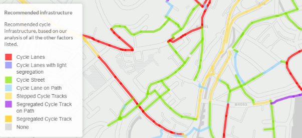
```

It is important to understand that the CyIPT recommendations are based on cycling levels in the 2011 census, and it may therefore under-represent current cycling levels and infrastructure requirements.  For more detail on the recommendation process, see the Technical Details section below.

Appropriate cycle infrastructure is based on guidance from Highways England IAN 195/16 [@highwaysengland_interim_2016]. Interventions are recommended for each segment based the following criteria:

- Whether the route is on road or off road (e.g. paths)
- The speed limit
- The motor traffic level
- The number of cyclists using the road (based on PCT Census 2011 scenario)

Using this information CyIPT makes one of seven possible recommendations.
Common infrastructure types are illustrated in the figures below:

- None

(Not shown) no specific cycling infrastructure is required.

- Cycle Lanes

A painted line on the roadway divides bicycles from other traffic:

```{r}
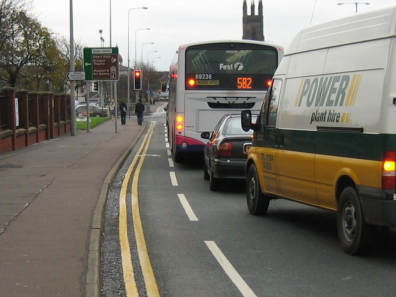
```

- Cycle Lanes with light segregation

Similar to cycle lanes but batons or armadillos are added long the line to reinforce the separation between cyclists and motor traffic:

```{r}
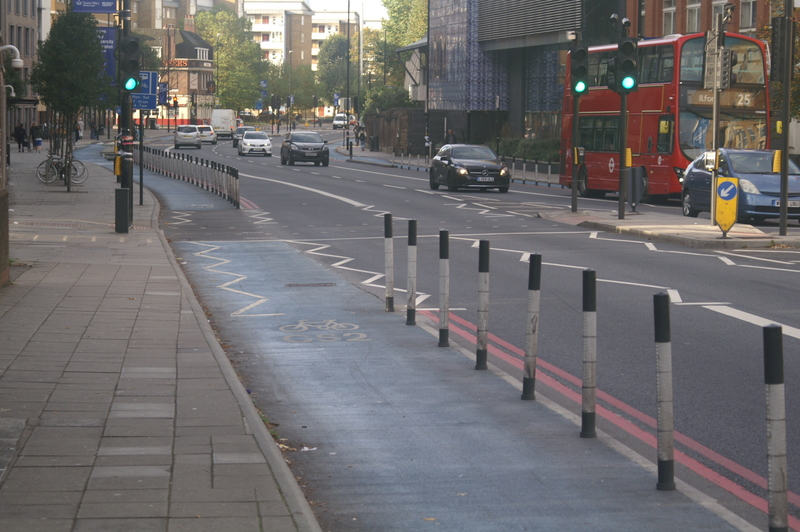
```

- Stepped Cycle Tracks

Cyclists travel on a slightly elevated lane, above the road traffic but below the pavement:

```{r}
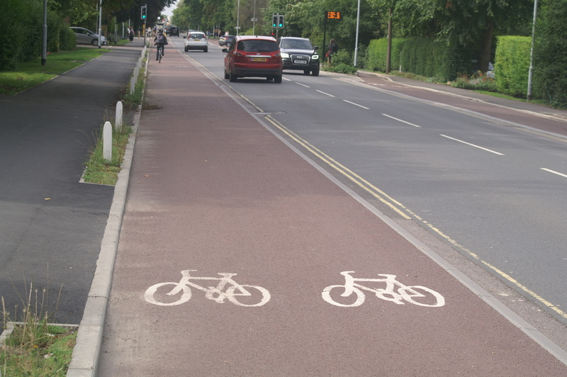
```

- Segregated Cycle Track

Cyclists travel in a separate lane physically separated from motor traffic by a hard barrier:

```{r}
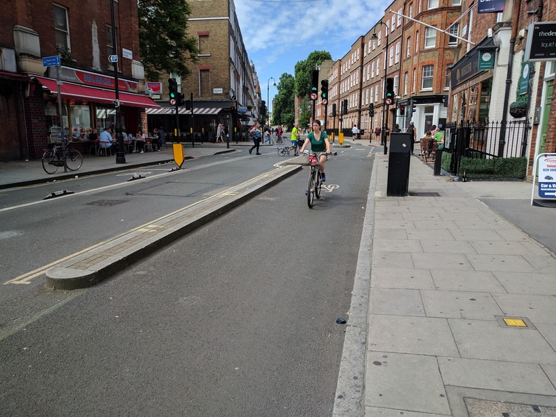
```

- Cycle Streets

These very quiet roads are primarily designed for cycling and walking while still allowing low speed motor traffic:

```{r}
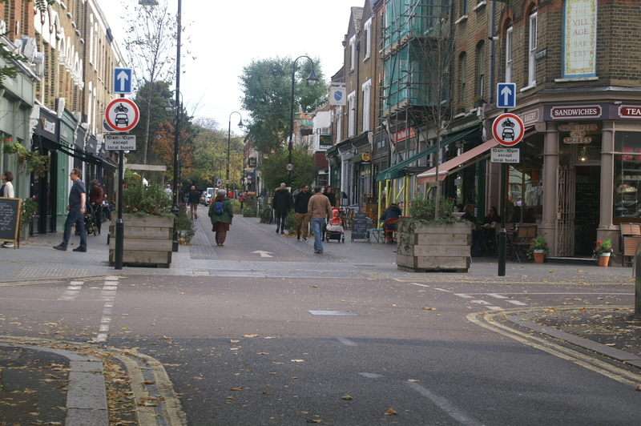
```

- Cycle Lane on Path

(Off Road Only) cyclists are separated from pedestrians by a painted line.

- Segregated Cycle Track on Path

(Off Road Only) cyclists are separated from pedestrians by a hard barrier.

## Road widths

The road width layer has two modes (road width, width status).
Road width

The road width layer shows and estimate of the road with based on the OSM.  The calculation use standard lane widths and information on the number of lanes and footways to estimate the total width of the carriageway.
Width status

The width status layer compares the estimated width of the road with any proposed new cycling infrastructure to width of the road as measured from the Ordnance Survey MaterMap. This mode helps highlight locations where road space is limited and space reallocation may be required to provide new cycling infrastructure. 

## Propensity to Cycle Tool

The Propensity to Cycle Tool layer takes data from the Propensity to Cycle Tool (PCT) (see [www.pct.bike](http://www.pct.bike/)) and provides an updated version for CyIPT. The layer is analogous to the PCT LSOA route network layer, which can also be accessed as a base map though CyIPT. CyIPT adds value to the PCT data by assigning cycling potential to OSM elements, making this layer more detailed and interactive than the equivalent LSOA layer in the PCT (see Figure \@ref(fig:layer-pct)).

```{r layer-pct, fig.cap="The Propensity to Cycle Tool layer."}
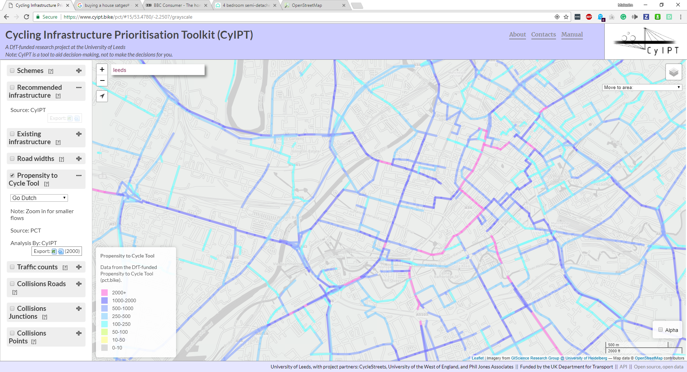
```

The PCT layer supports the same five scenarios as the main PCT tool, however only the 2011 census scenario is used within CyIPT. The PCT layer includes a value based rate limiting feature.

The PCT scenarios provide a useful way to cross validate the CyIPT uptake predictions. CyIPT typically predict that new infrastructure will increase cycling more than the Government Target scenario, but less than the Go Dutch scenario.  Forecasts outside this range should be subjected to additional scrutiny.  CyIPT makes no account for ebikes, and therefore the PCT ebike scenario is not applicable, however it is provided in the interest of completeness.

The PCT team is currently working on updated version of the PCT for Wales, and to include travel to schools.  These are not currently implemented within CyIPT but may be added in the future.

## Traffic counts

The traffic counts layer provides an overview of road traffic levels on selected roads (see Figure \@ref(fig:layer-traffic)). The data source is DfT traffic count data, which CyIPT then matches to the road network. As the DfT data is not provided for all locations in all years, CyIPT takes the most recent available year.  As illustrated in Figure \@ref(fig:layer-traffic) DfT data has good coverage of the strategic road network, but more limited coverage of minor roads.

```{r layer-traffic, fig.cap="The traffic layer."}
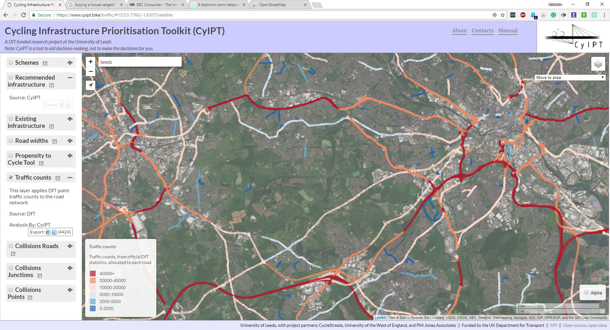
```

## Collisions roads

This layer takes the Stats19 data on road collision between 1985 and 2015 and matches collisions that did not occur at a junction to the nearest road (see Figure \@ref(fig:collision-roads)).  The layer provides a count of the total number of collisions that occurred on that road.  These can be filtered by the severity of collisions (slight, serious, fatal) and severity of bike casualties (slight, serious, fatal).

```{r collision-roads, fig.cap="The Collisions Roads layer. This layer should be used in conjunction with the Collision Junctions layer."}
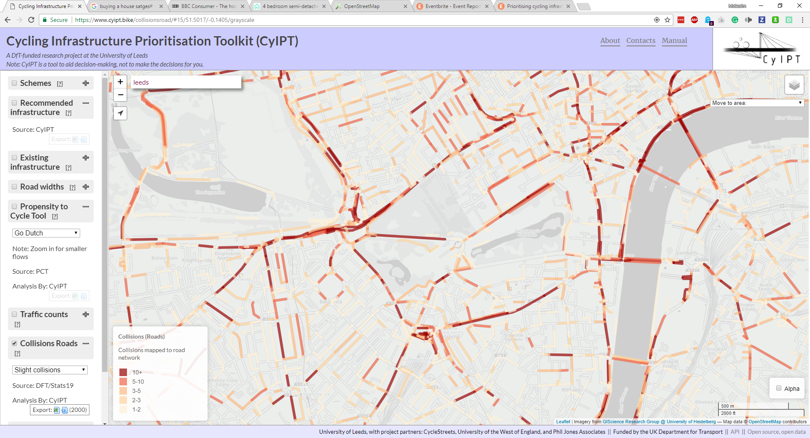
```

## Collisions junctions

This layer takes the Stats19 data on road collision between 1985 and 2015 and matches collisions that did occur at a junction to the nearest junction (see Figure \@ref(fig:collision-junctions)).  The layer provides a count of the total number of collisions that occurred on that road.  These can be filtered by the severity of collisions (slight, serious, fatal) and severity of bike casualties (slight, serious, fatal).

```{r collision-junctions, fig.cap="The Collisions Junctions layer. This layer should be used in conjunction with the Collision Roads layer."}
knitr::include_graphics("../images/layer-collision-junctions.png")
```

## Collisions points

This layer shows the locations of all collisions in the Stats19 data from 1985 to 2015, it can be filtered by year and severity (see Figure \@ref(fig:collision-points)).

```{r collision-points, fig.cap="The Collisions Points layer."}
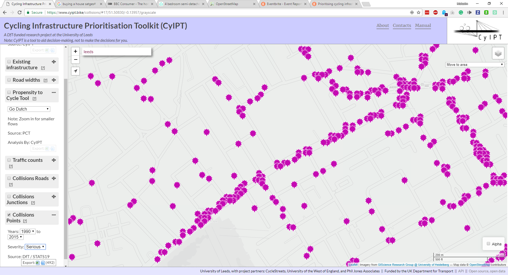
```

# Technical details

CyITP is developed in the R Programming language and is an open source project. The code is available at https://github.com/cyipt. CyIPT consists of two main parts; the R based analysis code, and the website, which is a mixture of HTML/CSS/JavaScript with a PostgreSQL database accessed via a PHP-based API.

This manual focusses on the R based analysis code, as the website exists purely for visualisation and ease of use.

## Data Preparation
CyIPT is reliant on some pre-existing datasets from third parties. While many of these are publicly available, CyIPT required them to be pre-processed before use. These scripts are provided for context, but in most cases, users should download the pre-processed data directly from GitHub.

## CyIPT Master Script

The CyIPT master script https://github.com/cyipt/cyipt/blob/master/scripts/cyipt.R can be used to run the whole CyIPT process.  It manages several global settings.

## Settings

```{r, eval=FALSE}
skip 
```

Should the code skip regions that have already been done?

```{r, eval=FALSE, echo=TRUE}
overwrite
```

Some stages overwrite existing files, for example by adding an extra column of data.
Note that not overwriting may cause later stages to fail if they expect earlier stages results to be in the starting file.

```{r, eval=FALSE, echo=TRUE}
ncores
```

Some functions use parallel processing how many clusters should be run? This should be less than the number of cores on your computer.

```{r, eval=FALSE, echo=TRUE}
verbose
```

Get extra messages and information while CyIPT is running.

```{r, eval=FALSE, echo=TRUE}
all.regions
```

Ignore the regions to do file and run for all regions.

## Regions to Do

If `all.regions = FALSE` CyIPT will choose which regions to run for based on the RegionsToDo file at https://github.com/cyipt/cyipt/blob/master/input-data/RegionsToDo.csv 

Placing `y` in the do column of this csv file will rerun the that region.

CyIPT uses the 2011 travel to work areas produces by the Office for National Statistics (ONS). Other boundaries could be used in the future.

## Libraries

CyIPT requires the following R libraries, which can be installed as follows:

```{r, echo=TRUE}
pkgs = c("sf",
         "osmdata",
         "stringr",
         "dplyr",
         "parallel",
         "xgboost",
         "igraph",
         "tmap"
         )
```

```{r, eval=FALSE, echo=TRUE}
install.packages(pkgs)
```

and loaded as follows:

```{r, message=FALSE, echo=TRUE}
vapply(pkgs, require, TRUE, character.only = TRUE)
```

## Step 1: Download the Data

https://github.com/cyipt/cyipt/blob/master/scripts/prep_data/download-osm.R

This script downloads the OSM road and path network for each region.

**Inputs:**

`Regions.todo`

Boundaries file "../cyipt-bigdata/boundaries/TTWA/TTWA_England.Rds"

**Outputs:**

Region Boundaries "../cyipt-bigdata/osm-raw/region/bounds.Rds"

OSM road network "../cyipt-bigdata/osm-raw/region/osm-lines.Rds"

OSM road junction points "../cyipt-bigdata/osm-raw/region/osm-junction-points.Rds" 
**Parallelised:**

Yes

## Step 2: Clean the OSM Tags

https://github.com/cyipt/cyipt/blob/master/scripts/prep_data/clean_osm.R

This script “cleans” the OSM data by removing or correcting errors and filling in missing data with best guesses.  Guessing is required, as some later stages of CyIPT require information (such as speed limits) which is not always available.  In isolated cases of incorrect guesses it is best to correct the value in the OSM using the “edit in the OSM” button on the CyIPT website. These corrections will then be incorporated into the next build of CyIPT.  In general cases of CyIPT miss-guessing, please submit and issue via GitHub https://github.com/cyipt/cyipt/issues 

**Inputs:**

`Regions.todo`

OSM road network "../cyipt-bigdata/osm-raw/region/osm-lines.Rds"

**Outputs:**

OSM road network "../cyipt-bigdata/osm-clean/region/osm-lines.Rds"

**Parallelised:**

No

### Detail

The cleaning process consist of the following stages:

1. Removing un-allowed road types (e.g. planned or demolished)
2. Replacing depreciated highway tags
3. Cleaning the junction tag
4. Summarising the one-way nature of roads
5. Guessing the max speed of roads with an unknown max speed based on road type
6. Guessing the presence of footways (pavements) with unknown footway status
7. Summarising the presence of bridges and tunnels
8. Cleaning the segregation status of cycle infrastructure
9. Cleaning a summary of the road type
10. Cleaning and/or guessing the number and nature of lanes in each direction
11. Cleaning the tagging of cycle infrastructure and improving detail of what is on each side of the road.

## Step 3: Get traffic counts

https://github.com/cyipt/cyipt/blob/master/scripts/prep_data/get_traffic.R

This script assigns the point traffic count data to the road network.

**Inputs:**

`Regions.todo`

OSM road network "../cyipt-bigdata/osm-clean/region/osm-lines.Rds"

Traffic Points "../cyipt-bigdata/traffic/traffic.Rds"

**Outputs:**

OSM road network "../cyipt-bigdata/osm-clean/region/osm-lines.Rds"

**Parallelised:**

No

### Details

This scrip divides the point traffic counts based on whether they are on classified (e.g. M21, B340) or unclassified roads. Unclassified road points are matched to the nearest road in the OSM, and therefore the value only extends a short distance from the point location. For classified roads, a series of Voronoi polygons are constructed around the points and all the road segments within each polygon are assigned the value of their nearest point. This provides continuous coverage, but can produce some erroneous results such as off ramps having the same traffic levels as the main carriageways.

In both cases, the script takes the Annual Average Daily Traffic (AADT) value from the most recent available year.  For the strategic road network, data is mostly from 2015/2016, but for minor roads, it can be significantly earlier. For the purposes of CyIPT is the traffic data is mostly used for identify the very busy and most hostile roads, thus this inconstancy of data is not a significant problem.  However, users intending to use the data or method for other purposes should consider the implications of this inconstancy within the data.

## Step 4: Split the lines at each junction

https://github.com/cyipt/cyipt/blob/master/scripts/prep_data/prep_osm.R

This script splits the roads at each junction into road segments. 

**Inputs:**

`Regions.todo`

OSM road network "../cyipt-bigdata/osm-clean/region/osm-lines.Rds"

OSM road junction points "../cyipt-bigdata/osm-raw/region/osm-junction-points.Rds"

**Outputs:**

OSM road network "../cyipt-bigdata/osm-prep/region/osm-lines.Rds"

**Parallelised:**

No

### Details

The splitting of the roads at junctions is mostly required for the later application of the PCT data.  Within the OSM a road may be represented by a single long line crossing several junctions.  However, at each junction cyclists may join or leave the road.  Therefore, it is not appropriate to analyse the road network as it is represented in the OSM.  By splitting the road network into segments it ensures that, the analysis is appropriately detailed.
Note the splitting is done by cutting tiny holes out of the road lines (r = 0.01m) therefore the lines are no longer touching; this would prevent this dataset being used in a routing engine.

## Step 5: Get the PCT estimate of number of cyclists

https://github.com/cyipt/cyipt/blob/master/scripts/prep_data/get_pct.R

**Inputs:**

`Regions.todo`

OSM road network "../cyipt-bigdata/osm-prep/region/osm-lines.Rds"

PCT LSOA Routes "../cyipt-securedata/pct-routes-all.Rds"

TTWA boundaries "../cyipt-bigdata/boundaries/TTWA/TTWA_England.Rds"

**Outputs:**

OSM road network "../cyipt-bigdata/osm-prep/region/osm-lines.Rds"

PCT LSOA Routes (Regional) "../cyipt-securedata/pct-regions/region.Rds"

PCT to OSM lookup (Regional) "../cyipt-bigdata/osm-prep/region/pct2osm.Rds"

OSM to PCT lookup (regional)  "../cyipt-bigdata/osm-prep/region/osm2pct.Rds"

**Parallelised:**

Yes

### Details

This script matches the Propensity to Cycle Tool (PCT) LSOA route data with individual road segments to count the number of cyclists on each road segment.  Values from each of the five PCT scenarios are recorded:

```
Census 2011
Government Target
Gender Equality
Go Dutch
Ebikes
```

While the matching process is reasonably robust, small errors can occur resulting in missing segments, or double counting. 

As the PCT data was unidirectional routed (A to B, but not B to A) the results are less accurate on dual carriageways.  For example, the PCT is constructed from Census 2011 Origin-Destination data matched to routes produced by CycleStreets.  The Origin and Destinations are Lower Level Super Output Areas.  The census state that 30 people live in LSOA A and work in LSOA B, and 50 people live in LSOA B and work in LSOA A. The CycleStreets provide a route from A to B, and the PCT assign this route a value of 80 (50 + 30).  This method does not therefore take account of the route A to B being different from the route B to A, due to one way streets, roundabouts etc.  Nor does it consider that commuters return home at the end of the day. 

In these cases, the number of cyclists is split between the carriageways with usually with most on one carriageway (see Figure \@ref(fig:unidirectional)). 

```{r unidirectional, fig.cap="Effects of Unidirectional Routing."}
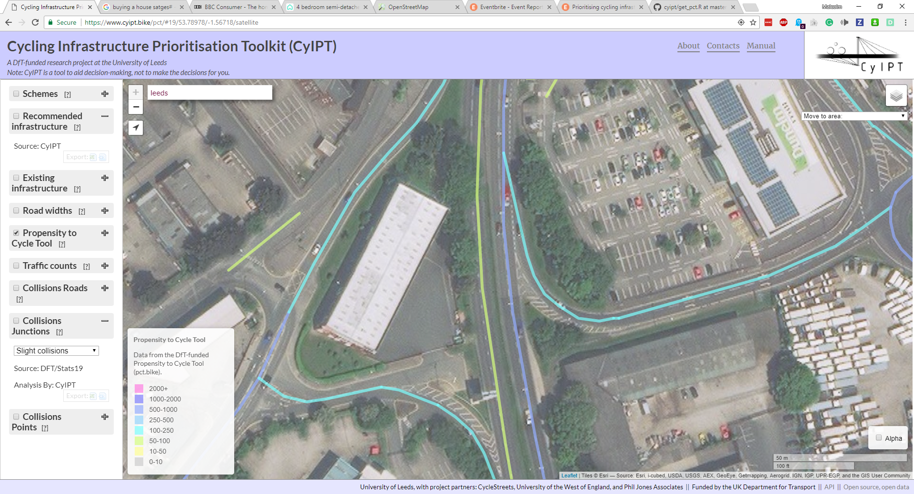
```

## Step 6: Get road width estimates and collisions

```{r, eval=FALSE, echo=TRUE}
source("scripts/prep_data/get_widths.R")
source("scripts/prep_data/get_collisions.R")
```


## Step 7: Evaluate Infrastructure Options

```{r, eval=FALSE, echo=TRUE}
source("scripts/select_infra/select_infra.R")
```

## Step 8: Compare Widths Needed to Widths Available

```{r, eval=FALSE, echo=TRUE}
source("scripts/select_infra/compare_widths.R")
```

## Step 9: Group into schemes

```{r, eval=FALSE, echo=TRUE}
source("scripts/select_infra/make_schemes2.R")
```

## Step 10: get uptake and benefits

```{r, eval=FALSE, echo=TRUE}
source("scripts/uptake/calc_uptake_routechange3.R")
```


# General Comments

## UK emphasis

CyIPT was developed for England and has several UK biases built in.  For example:

1. All geospatial analysis is perfumed using the British National Grid
2. Left had driving is assumed
3. Speed limits are in mph  
If you wish to use CyIPT outside the UK these assumptions will not hold and need to be fixed in the code.

# References
