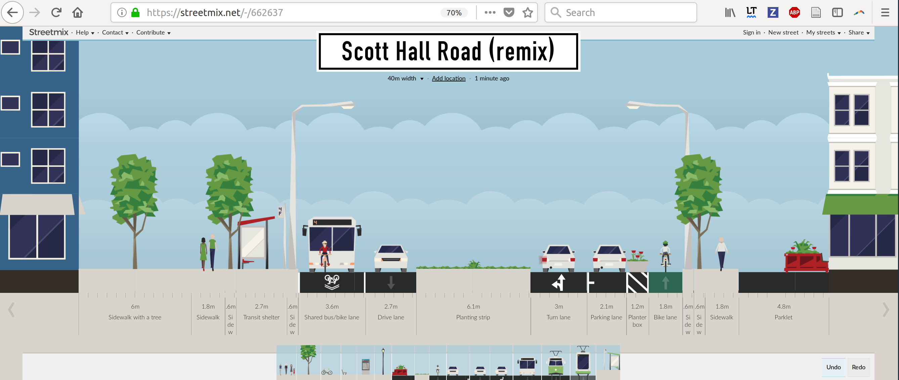

```{r, include=FALSE}
knitr::opts_chunk$set(echo = FALSE, out.width = "100%")

# compile with:
# bookdown::render_book("index.Rmd")
# bookdown::render_book("index.Rmd", "bookdown::pdf_document2")
# Run the previous command and...
# Uncomment this line to build pdf version of manual:
# knitr::opts_chunk$set(echo = FALSE, out.width = "100%")
```

# Introduction

The Cycling Infrastructure Prioritisation Toolkit (CyIPT) is a research project led by the University of Leeds and funded by the Department for Transport (DfT).  The purpose of CyIPT is to develop methods and tools to assist in the design and planning of new cycling infrastructure.

CyIPT was funded by the Innovation Challenge Fund (ICF) to demonstrate the readiness of technology to automate the early stages of the planning process for cycling infrastructure --- scheme evaluation.
The aim was to:

> tackle the challenge that cycling uptake is often limited by infrastructural barriers which could be remediated cost-effectively, yet investment is often spent on less cost-effective interventions, based on assessment of only a few options.

This aim builds on the work already on the Propensity to Cycle Tool (PCT) to estimate the *potential* for cycling uptake nationwide .
[@departmentfortransport_national_2016].
The PCT does this by analysing origin-destination data on travel patterns to identify trips that could be replaced by cycling nationally, down to the route-network level [@lovelace_propensity_2017].
While the PCT focusses on *where* to prioritise a core cycling network, CyIPT focusses on *what* to build and *when*, in terms of prioritisation.

A schematic diagram was prepared for the original plan, which provides an opportunity to reflect on the extent to which we have delivered on the four components envisaged at the project's inception (Figure \@ref(fig:schematic)):

- **Classification:** We have automated the classification of segments and schemes using algorithms developed for the project.
- **Interventions:** The type of interventions recommended by CyIPT for any particular road segment are derived from advice provided by a Highways England Interim Advice Note  [@_interim_2016].
- **Evaluation:** Benefit-cost ratios (BCRs) are estimated based on costs taken from a DfT-funded report on typical costs of cycle infrastructure [@transportforqualityoflife_typical_2016].
- **Outputs:** As planned the outputs are available in an on-line mapping tool available (although currently password-protected) at [www.cyipt.bike](http://cyipt.bike/).

```{r schematic, fig.cap="Schematic diagram of CyIPT presented in the initial work plan.", out.width="100%"}
# knitr::include_graphics("https://raw.githubusercontent.com/cyipt/cyipt/master/figures/schematic-flow-diagram.png")
knitr::include_graphics("~/cyipt/cyipt/figures/schematic-flow-diagram.png")
```

The CyIPT tool delivers on the aim of providing an accessible evidence-base to identify cost-effective areas to intervene in a way that is scalable and consistent nationwide.
For the first time it combines geographic data on many factors related to cycling at the road-link level, including:

- Existing infrastructure: seeing gaps in existing networks can help decide how to join them up.
- Possible schemes: CyIPT prevents 'information overload' and provides intuitive schemes by aggregating recommenended infrastructure (another layer representing the same data on a segment-by-segment basis) into schemes that can be viewed as a layer in the interactive map, with associated estimated costs and benefits.
- Road widths: this is a crucial consideration when deciding whether or not new cycleways can be provided on existing roads, or whether an alternative solution, such as road-space-reallocation will be needed.
- Cycling potential: the existing level of cycling and future potential on the road network should be central when developing strategic cycling networks.
- Traffic counts: an important consideration when deciding what to build is prevailing motor traffic. If speeds and volumes are low, protected cycleways are seldom necessary. If they are high, and contain many large vehicles, by contrast, physical protection is all-but essential if any infrastructure is to be provides on the road in question. Traffic counts were taken from the DfT's AADT dataset and assigned to the road network. This accounts for a large portion of the Strategic Road Network (SRN) but is limited on smaller roads.
- Collisions: The level of danger to people cycling on the road network should be a major consideration when prioritising where to invest, and in what. A crash hotspot is likely to need remedial attention in terms of road speeds or junction design whereas relatively high crash rates along an entire road may indicate the need for a protected cycleway or an alternative route clearly signposted away from fast moving traffic. CyIPT provides three collision layers: at the road segment, junction and individual crash level.

By visualising each of these layers (many of which have sub-layers and alternative options) interactively, planners can ensure that their decisions are based on a wide range evidence.
The range of layers available mean that documentation of the tool is vital, meaning that, although it was not written-into the original specification, a detailed (~30 page) Manual was written to accompany the CyIPT website. This is available at [cyipt.bike/manual](https://www.cyipt.bike/manual/), and should be read as a document providing technical detail to accompany this relatively high-level report.

The CyIPT was designed to be used. In keeping with the saying "actions speak louder than words", we therefore reading this report in tandem with using the tool, which can be found at [www.cyipt.bike](https://www.cyipt.bike/).

# Method

The CyIPT is a big data project, meaning much of the work involved accessing, colating, cleaning and pre-processing data.
The initial plan was to build CyIPT completely for a single region (Bristol) before creating a national version.
In practice it became clear that time was better invested in 'optimising early' to create methods that would scale nationally from the beginning meaning that, although we did use Bristol as the main case study city, we were aiming to create a nationally scalable product all along, avoiding problems associated with scaling-up later down the line.

This involved getting-up-to-speed with software for handling OSM data such as the **osmdata** R package [@Padgham2017] and 'simple features', a new class system for spatial data in the R programming language [@rcoreteam_language_2017].

OpenStreetMap (OSM) data was downloaded in bulk and a much work was put into cleaning the user-contributed tags that define road type and other features.

A major challenge early on was calculation of road widths, or rather the width of road space available to construct new cycle infrastructure.
To visualise the availability/unavailability of street space the website [streetmix.net](https://streetmix.net/-/553093) (see Figure \@ref(fig:streetmix)).
Although promising for visualising roads on a one-by-one basis, we decided not to streetmix in the final version because we could not find ways to automate the production of road width types.

```{r streetmix, fig.cap="Example visualisation from the streetmix website. Could this be a way to help stakeholders assess width constraints?"}
# knitr::include_graphics("https://www.cyipt.bike/images/streetmix-example.png")

```

To overcome the road-widths challenge we turned to Ordnance Survey (OS) data.
We used the rule that width is approximately the area of a polygon divided by the half of the perimeter length in combination with polygons provided by OS representing the public domain of roads.
This allowed for the automatic calculation of road widths nationwide.
To make the results intuitive and avoid any potential licencing issues with OS data the results of these calculations are presented approximately and in relation to new infrastructure, ranging from "Insufficient" to "More than sufficient" width (see the CyIPT Manual, section [4.6](https://www.cyipt.bike/manual/layer-descriptions.html#road-widths)).

Another major challenge was the estimation of uptake following new infrastructure.

# Results

The overall result of the project is a prototype national map for cycling infrastructure prioritisataion, in-line with the initial aim of the project.
As described in the CyIPT Manual and shown on the main panel at [www.cyipt.bike](https://www.cyipt.bike/#6/53.690/-2.142/mapnik), there are 9 layers available to the user providing an unprecedented level of data access of relevance to cycle planning in a single place.


## The CyIPT workshop

# Discussion and next steps

A number of innovations have been developed for CyIPT and from the results of the workshop it seems that there is high demand for them among practitioners.
CyIPT has demonstrated that it *is* possible to automate the first stage of the planning process for cycling, enabling planners to focus their skills where they are most needed: in evaluating the technical and economic feasibility of schemes that *are known* to make sense based on some of the best availabe data.
CyIPT works nationally and includes a wide range of data sources, but it should not be seen as a finished product.

This section discusses some of the limitations of CyIPT after this initial Phase I.
This discussion feeds directly into the identification of areas in which there is great potential for further development of the tool.
The next steps for CyIPT can be taken in a range of directions, but they should be informed by an honest appraisal of the limitations of the project (and modelling overall) for planning for cycling and an understanding of the resource requirements for different directions of travel in terms of time and public investment in decision-making tools.

An important aspect of CyIPT Phase I is that recommendations are based on *existing levels of cycling* (or rather cycle commuting along the fastest route in 2011).
For this reason the results of CyIPT can be seen as the network that cities *should already have* for a given level of cycling, accounting only for commuter cycling.
This suggests that adding new cycling potential layers such as cycle to school (e.g. made available by PCT Phase III) and new scenarios moving beyond existing levels of cycling as next steps.

Options for next steps:

- Identify ways to automate the production of street width constraints, e.g. by creating an interfact to the code underlying the streetmix website.

During the final months of the CyIPT project and following the successful CyIPT workshop plans for follow-on work are in motion.
It seems there is high demand for the type of interactive evidence on infrastructure options provided by CyIPT and there are many options for taking the project forward.

## Feedback {-}

CyIPT is a publicly accessible research project based on open source software, the results of which are available in an online map-based tool at [www.cyipt.bike](https://www.cyipt.bike) (currently password protected).

The code underlying CyIPT is hosted on GitHub, a platform for software development and collaboration that also provides and excellent forum for discussing issues and providing feedback as follows:

- Feedback on CyIPT Results and Methods: [github.com/cyipt/cyipt/issues](https://github.com/cyipt/cyipt/issues) 
- Feedback on CyIPT website and user interface: [github.com/cyipt/cyipt-website](https://github.com/cyipt/cyipt-website/issues)

Hosting the code on GitHub also enables community contributions.
If you find any issues on this user manual, for example, suggested changes to the source code are welcome [here](https://github.com/cyipt/cyipt-website/edit/master/man/index.Rmd), which requires a GitHub username from [github.com](https://github.com/).

Alternatively we welcome your feedback at info@cyipt.bike.

## The CyIPT Core Team {-}

- Dr Robin Lovelace, University of Leeds
- Dr Malcolm Morgan, University of Leeds
- Prof John Parkin, University of the West of England
- Martin Lucas-Smith, CycleStreets.net

```{r}
knitr::include_graphics("../images/logo.png")
```

# References
