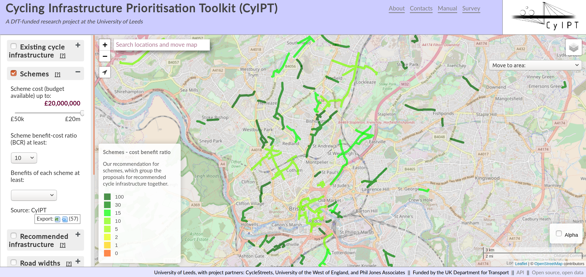

```{r, include=FALSE}
knitr::opts_chunk$set(echo = FALSE, out.width = "100%")

# compile with:
# bookdown::render_book("index.Rmd")
# bookdown::render_book("index.Rmd", "bookdown::pdf_document2")
# bookdown::render_book("index.Rmd", "bookdown::word_document2")
# Run the previous command and...
# Uncomment this line to build pdf version of manual:
# knitr::opts_chunk$set(echo = FALSE, out.width = "100%")
```

\newpage

# Project overview


Timeframe of the project and date of the report:

- The project ran from March 2017 until March 2018

Locations (country, region, etc.) of the project:

- Leeds, West Yorkshire UK (University of Leeds)
- Cambridge (CycleStreets.net)
- Bristol (University of West of England)

Names and/or organisations of project team:

- Dr Robin Lovelace, University of Leeds
- Dr Malcolm Morgan, University of Leeds
- Prof John Parkin, University of the West of England
- Martin Lucas-Smith, CycleStreets.net

Table of contents which also lists Tables, Graphs, Figures and Annexes:

For ToC see front page. List of Figures:

- Figure \@ref(fig:schematic)
- Figure \@ref(fig:streetmix)
- Figure \@ref(fig:sevnet)
- Figure \@ref(fig:uptake-la)
- Figure \@ref(fig:uptake-bris)
- Figure \@ref(fig:bcr)

1.5. List of acronyms

- API: Application programming interface
- BCR: Benefit-cost ratio
- CyIPT: Cycling Infrastructure Prioritisation Toolkit
- DfT: Department for Transport
- GDS: Government Digital Services
- GIS: Geographic information system
- ICF: Innovation Challenge Fund
- OSM: OpenStreetMap

\newpage

# Executive summary

## Overview of the project

The overall purpose of the project was to demonstrate that it is possible to produce software capable of making automated recommendations for the best locations to build new cycling infrastructure. This has been achieved through the prototype www.cyipt.bike website, which presents an interactive map of England, showing the most promising schemes and other relevant information.

## Project objectives and intended audience

To meet the overarching aim, the research met the following objectives:

- Classify geographic data on the route network into discrete features that represent potential barriers to cycling uptake.
- Filter from the multitude of barriers generated in the previous stage based on data on cycling potential (from the PCT) and a proxy for road safety (road traffic casualty data)
- Identify interventions on the filtered set of barriers that would alleviate these barriers to cycling by overlying cycling potential at the desire line and route network level. For instance, a busy road running in the same direction as cycling desire lines, for example, could result in the identification of a segregated cycle path parallel to the road. A barrier running perpendicular to cycling desire lines could lead to the addition of ‘missing links’, e.g. the creation of a route connecting two proximate cycle paths.
- For each intervention, estimate costs based on recently-collated data presented in Taylor and Hiblin (2016), and from data that has been used as part of the National Cycling and Walking Infrastructure Plan project for the DfT as developed by Phil Jones Associates.
- For each intervention, estimate cycling uptake by re-running a regression model on the modified route network for all trips affected by the intervention.
- Analyse the estimated cost-effectiveness of all schemes on the route network and validate the results of known interventions. 
- Elicit feedback from experts, practitioners (including Leeds City Council and the Urban Transport Group – see Letters of Support) and the DfT after the 3-month report and prototype results are complete.
Refine the method based on feedback from the validation stage.
- Optimise the method on a high-performance computer (HPC) infrastructure at the Leeds Institute for Data Analytics (LIDA).
- Run the method for all of England and save the results in appropriate formats and levels of aggregation.
- Visualise the results in an online interactive map allowing decision-makers to prioritise the most cost-effective schemes.
- Make the data available for practitioners, researchers and other projects in a user-friendly form, e.g. via an online Application Programming Interface (API), whose results can also be used in GIS systems.

The intended audience is professionals and informed stakeholders working to increase the level of cycling in cities across England and beyond.

## Project methodology

The methodology involved developing and implementing methods for processing route infrastructure data at a national scale, developing methods for estimating levels of cycling to be expected from specific interventions, and web development methods to deploy the results in an online, interactive mapping portal.

## Most important findings and conclusions 

The most important finding is that the vision driving CyIPT — automation of a-priori scheme evaluation during the initial stages of the planning process — can feasibly be implemented and scaled nationwide using existing datasets and digital technologies.
Feedback from key stakeholders suggests that the CyIPT project results are likely to be useful in the planning process and there was high demand for a publicly-accessible version of the tool.

## Main recommendations/next steps

Based on experience with CyIPT to date, we recommend that the project is taken forward to Phase II.
That will allow the team to act on valuable feedback collected during the end of project workshop and meet the requirements of GDS to allow the CyIPT to be made publicly-accessible. More detailed recommendations are provided at the end of this report.

\newpage

# Introduction

The Cycling Infrastructure Prioritisation Toolkit (CyIPT) is a research project led by the University of Leeds and funded by the Department for Transport (DfT).  The purpose of CyIPT is to develop methods and tools to assist in the design, planning and prioritisation of new cycling infrastructure.

CyIPT was funded by the Innovation Challenge Fund (ICF) to demonstrate the readiness of technology to automate the early stages of the planning process for cycling infrastructure — scheme evaluation.
The aim was to:

> tackle the challenge that cycling uptake is often limited by infrastructural barriers which could be remediated cost-effectively, yet investment is often spent on less cost-effective interventions, based on an assessment of only a few options.

This aim builds on the work already on the Propensity to Cycle Tool (PCT) to estimate the *potential* for cycling uptake nationwide
[@departmentfortransport_national_2016].
The PCT does this by analysing origin-destination data on travel patterns to identify trips that could be replaced by cycling nationally, down to the route-network level [@lovelace_propensity_2017].
While the PCT focusses on *where* to prioritise a core cycling network, CyIPT focusses on *what* to build and *when*, in terms of prioritisation.

A schematic diagram was prepared for the original plan, which provides an opportunity to reflect on the extent to which we have delivered on the four components envisaged at the project's inception (Figure \@ref(fig:schematic)):

- **Classification:** We have automated the classification of segments and schemes using algorithms developed for the project.
- **Interventions:** The type of interventions recommended by CyIPT for any particular road segment are derived from advice provided by a Highways England Interim Advice Note  [@_interim_2016].
- **Evaluation:** Benefit-cost ratios (BCRs) are estimated based on costs taken from a DfT-funded report on typical costs of cycle infrastructure [@transportforqualityoflife_typical_2016].
- **Outputs:** As planned the outputs are available in an online mapping tool available (although currently password-protected) at [www.cyipt.bike](http://cyipt.bike/).

```{r schematic, fig.cap="Schematic diagram of CyIPT presented in the initial work plan.", out.width="70%", fig.pos="h"}
# knitr::include_graphics("https://raw.githubusercontent.com/cyipt/cyipt/master/figures/schematic-flow-diagram.png")
knitr::include_graphics("~/cyipt/cyipt/figures/schematic-flow-diagram.png")
```

The CyIPT tool delivers on the aim of providing an accessible evidence-base to identify cost-effective areas to intervene in a way that is scalable and consistent nationwide.
For the first time, it combines geographic data on many factors related to cycling at the road level, including:

- Existing infrastructure: seeing gaps in existing cycling networks can help decide how to join them up.
- Possible schemes: CyIPT prevents 'information overload' and provides intuitive schemes by aggregating recommended infrastructure (another layer representing the same data on a segment-by-segment basis) into schemes that can be viewed as a layer in the interactive map, with associated estimated costs and benefits.
- Road widths: this is a crucial consideration when deciding whether or not new cycleways can be provided on existing roads, or whether an alternative solution, such as road-space-reallocation will be needed.
- Cycling potential: the existing level of cycling and future potential on the road network should be central when developing strategic cycling networks.
- Traffic counts: an important consideration when deciding what to build is prevailing motor traffic. If speeds and volumes are low, protected cycleways are seldom necessary. If they are high, and contain many large vehicles, by contrast, physical protection is all-but-essential if any infrastructure is to be provided on the road in question. Traffic counts were taken from the DfT's AADT dataset and assigned to the road network. This accounts for a large portion of the Strategic Road Network (SRN) but is limited on smaller roads.
- Collisions: The level of danger to people cycling on the road network should be a major consideration when prioritising where to invest, and in what. A crash hotspot is likely to need remedial attention in terms of road speeds or junction design whereas relatively high crash rates along an entire road may indicate the need for a protected cycleway or an alternative route clearly signposted away from fast-moving traffic. CyIPT provides three collision layers: at the road segment, junction and individual crash level.

By visualising each of these layers (many of which have sub-layers and alternative options) interactively, planners can ensure that their decisions are based on a wide range evidence.
The range of layers available means that documentation of the tool is vital, meaning that, although it was not written into the original specification, a draft (~30 page) Manual was written to accompany the CyIPT website. This is available at [cyipt.bike/manual](https://www.cyipt.bike/manual/), and should be read as a document providing technical detail to accompany this relatively high-level report.

\newpage

# Method

The CyIPT is a big data project, meaning much of the work involved accessing, collating, cleaning and pre-processing data.
The initial plan was to build CyIPT completely for a single region (Bristol) before creating a national version.
In practice, it became clear that time was better invested in 'optimising early' to create methods that would scale nationally from the beginning. This meant that, although we did use Bristol as the main case study city, we were aiming to create a nationally-scalable product all along, avoiding problems associated with scaling-up later down the line.

This involved working with software for handling OSM data such as the **osmdata** R package [@Padgham2017] and 'simple features', a new class system for spatial data in the R programming language [@rcoreteam_language_2017].

OpenStreetMap (OSM) data was downloaded in bulk and a much work was put into cleaning the user-contributed metadata (known as 'tags') that define road type and other features. The decision to use OpenStreetMap, rather an alternatives such as Ordnance Survey data, was due to the higher levels of detail about cycling networks provided in OSM, and the flexible and open licencing terms of OSM data.

A major challenge early on was the calculation of road widths, or rather the width of road space available to construct new cycle infrastructure.
To visualise the availability/unavailability of street space the website [streetmix.net](https://streetmix.net/-/553093) (see Figure \@ref(fig:streetmix)).
Although promising for visualising roads on a one-by-one basis, we decided not to streetmix in the final version because we could not find ways to automate the production of road width types.

```{r streetmix, fig.cap="Example visualisation from the streetmix website. Could this be a way to help stakeholders assess width constraints?"}
# knitr::include_graphics("https://www.cyipt.bike/images/streetmix-example.png")
knitr::include_graphics("../images/streetmix-example.png")
```

To overcome the road-widths challenge we turned to Ordnance Survey (OS) data. The CyIPT Team has access to a 2005 copy of the OS MasterMap for England. The code was developed to measure the width of the road polygon in the MasterMap and assign that value to the line representation of the road in the OSM.

To make the results intuitive and avoid any potential licencing issues with OS data, the results of these calculations are presented approximately and in relation to new infrastructure, ranging from "Insufficient" to "More than sufficient" width (see the CyIPT Manual, section [4.6](https://www.cyipt.bike/manual/layer-descriptions.html#road-widths)).

Another major challenge was the estimation of uptake following new infrastructure.
It is well known that building appropriate infrastructure (protected cycleways) in appropriate places can lead to dramatic uptake of cycling, as illustrated by the example of Seville, Spain, which we use here by way of a comparative example.
Despite high temperatures there, cycling levels in the city quadrupled following investment in a carefully planned route network (illustrated in Figure \@ref(fig:sevnet)) from less than 2% before 2006 to more than 8% (in the survey month of November) following infrastructure investment [@marques_how_2015]. This network represents around 0.3 m of segregated cycle infrastructure per person (~200 km divided among the city's ~700,000 people).
 

```{r sevnet, fig.cap="The core cycling network in Seville, composed of the basic (77 km) and complementary (120 km) protected cycle path network, which led to cycling increasing fourfold."}
# (120 + 77) * 100 / 700
knitr::include_graphics("~/ATFutures/who/fig/sevnet2.png")
# knitr::include_graphics("https://raw.githubusercontent.com/ATFutures/who/master/fig/sevnet2.png")
```

Translating knowledge of the success of Seville's infrastructure provision into practice is not a simple process. 
A simplistic approach would be to divide the increase in cycling levels (around 6 percentage points) by the length of new infrastructure (around 200 km), which would imply that new infrastructure leads to cycling uptake at a rate of around one percentage point per 30 km of cycling provision.

Assuming this relationship found in Seville holds everywhere would be naïve, not only due to cultural differences between the UK and Spain but also due to a number of measurable differences between paths constructed in one place that may not apply in another:

- Level of cycling potential: clearly a cycle path constructed where there is high latent demand will attract more users than a path constructed where there is little demand.
- Type of infrastructure: high quality, wide, cycleways offering protection from motor traffic can be expected to have a greater impact on cycling levels than thin unprotected cycle lanes, for example.
- The conditions on the rest of the route beyond the interventions are likely to play a role. For example, cycling infrastructure that allows a cyclist to avoid busy roads is likely to generate more uptake than infrastructure that substitutes for existing quiet 20mph streets.

Each of these factors was accounted for using an uptake model that used historic interventions (between 2011 and 2001) to predict change in cycling between the 2001 and 2011 census, at the MSOA origin-destination level. 
An illustration of the input datasets that allowed this model is presented at the regional level in Figure \@ref(fig:uptake-la).

```{r uptake-la, fig.cap="Illustration of the relationship between infrastructure creation (2001 - 2011 - source Sustrans and Transport Direct) and change in cycling levels over the same period (source: origin-destination data from Wicid). Named regions had levels of cycling uptake and levels of infrastructure provision above the median."}
knitr::include_graphics("~/cyipt/cyipt-website/images/ttwa-uptake.png")
```

Figure \@ref(fig:uptake-bris) illustrates how the data look at the local level, with individual origin-destination pairs 'exposed' to infrastructure clear from where they crossed the grey blobs (representing interventions).
The fact that the dependent variable (cycling uptake) operates at a different level from the primary dependent variable (new cycling infrastructure) poses a question:
how to measure 'exposure' to new infrastructure?

A number of approaches were tested, including the length of infrastructure within a buffer of the straight line representing each OD pair, and the average proximity to new infrastructure for each OD pair.
In the end, however, a more narrow definition of exposure was used: length of new infrastructure present *on the fastest route* for each OD pair.
Although more restrictive, this definition had the advantage that it was directly applicable to the input data used by CyIPT.
Furthermore, it allowed additional variables such as the percentage of the trip after an intervention that could be made on roads with low speed limits.
It was found that low speed limits of the route were a powerful predictor of cycling uptake following new infrastructure.
To model this the percentage of the route at different speed limits was used as an *interaction variable* that diminished the effectiveness of new infrastructure for fast (40mph+) roads and increased the effectiveness of new infrastructure in cases where the percentage of the route that was on low speed limit roads was high.

```{r uptake-bris, fig.cap="Illustration of the input data at the local level in Bristol."}
u = "https://github.com/cyipt/cyipt/raw/master/historic-uptake_files/figure-markdown_strict/unnamed-chunk-2-5.png"
# knitr::include_graphics(u)
knitr::include_graphics("~/cyipt/cyipt/historic-uptake_files/figure-markdown_strict/unnamed-chunk-2-5.png")
```

(The reference in the above paragraph to the 'fastest route' refers to the modelling of likely cyclist route preferences available from the CycleStreets cycle journey planner.
This system provides a set of suggested routes for each A-B OD pair, in the form of a fastest route, quietest route, and a balanced route between these.
Such routes are also used by the Propensity to Cycle Tool.
Ongoing improvements in the routing engine modelling were made during the CyIPT work, reflecting the importance of aiming for maximum accuracy of these routes.)

One of the input datasets used in the uptake model was a newly-available dataset liberated by CycleStreets as part of the project.
The DfT England Cycling Data project was an initative in 2011 to convert data collected for the (now-defunct) Transport Direct cycle journey planner project and make it available for use in OpenStreetMap.
This data had not hitherto been released, but conversion work within the CyIPT project has now enabled this dataset to become [publicly available](https://github.com/cyclestreets/dft-england-cycling-data-2011) using open standards (GeoJSON), maximising taxpayer value for this data.

To present the results of the uptake model on the map user interface, a slider was used to allow the user to select how much funding they had available per scheme.
A drop-down menu was added to enable the user to filter-out schemes depending on their associated BCRs.
This method of selecting schemes can be used to interactively identify worthwhile schemes in the city of interest, with promising schemes for Bristol illustrated in Figure \@ref(fig:bcr).

```{r bcr, fig.cap="Schemes with high estimated BCRs illustrated for Bristol, selected using the BCR dropdown menu in the Schemes layer."}

```

\newpage

# Results

The overall result of the project is a prototype national map for cycling infrastructure prioritisation, in-line with the initial aim of the project.
As described in the CyIPT Manual and shown on the main panel at [www.cyipt.bike](https://www.cyipt.bike/#6/53.690/-2.142/mapnik), there are nine layers available to the user, providing an unprecedented level of data access of relevance to cycle planning in a single place.

The headline figures of the results are as follows:

- 9,342 schemes recommended across England
- costing an average of £730,000 and with a total cost of £6.8bn
- with an average length of 1.1 km and a total length of 10,600 km
- average estimated benefits were £1,467,000 and total benefits of £13.7bn
- the median estimated BCR was 1.51.

These numbers may sound large but they are illustrative of the kind of investment that may be needed for a national cycling revolution.
Investment of this type is not unprecedented: in The Netherlands, investment in cycling infrastructure on this scale began in the mid-1970s and is a major factor explaining the nation's high cycling levels and associated high levels of public health [@pucher_making_2008].
The construction of 10,000+ km of cycleways, for example, may seem like a tall order but even if such a network were built England would have a cycle network half the size of the Dutch cycle network in absolute terms — The Netherlands had 18,948 km of cycleways in 1996 [@pucher_making_2008] which has since grown further — and around 1/6^th^ the size of the Dutch cycleway network per person, with England's population of 53 million 3 times larger than Holland's with 17 million.
In this connection, it is also worth noting the outcome of the All-Party Parliamentary Cycling Group '[Get Britain Cycling](https://allpartycycling.org/inquiry/)' report, which recommended an initial investment level of at least £10 per person per year.

It should also be noted that CyIPT evaluates each scheme in isolation, and therefore is unable to evaluate network effects where the construction of multiple linked schemes result in a greater increase that would be expected from each individual scheme. For example, an average CyIPT scheme of about 1.1 km would only increase cycling by 20%, which is to be expected as it could only benefit a small number of travellers. Related to this, CyIPT may propose two nearby schemes independently, where only one would in practice be needed due to their proximity; further work would be able to address this. Furthermore, as CyIPT uses data from the PCT it only considers commuters and thus the impact on other types of journey is not considered.

As expected the BCR results favour schemes that are close to the centre of major cities, illustrating the fact that there is most unmet demand near city centres.
To some extent this result reflects the fact that the CyIPT is based on cycling levels from the commute layer of the PCT:
using the planned school layer from the PCT Phase III will likely show a more nuanced distribution of BCRs also emphasising residential areas surrounding major schools.

An important aspect of the project was that the results were evaluated by key stakeholders at different points during the project.
Zsolt Schuller, for example, provided feedback on the results for Exeter.
Overall, he found the tool encouraged him to look at possible schemes that had previously been given little attention:

> this could be useful even if just to act as leverage in encouraging Local Authorities to revisit locations of where schemes may or may not have been considered in the past (Zsolt Schuller)

More detailed feedback was provided for a number of specific roads, leading to some changes to CyIPT, and illustrating how CyIPT could be used in practice.
The following quote, for example, refers to the results for Heavitree Road:

> Highlights good options along long stretches of the route. Does still recommend lanes through a difficult section which is useful to generate discussion about what could be done (Zsolt Schuller)

Many other people provided formal and informal feedback on the project, including:

- Chris Mason, Bristol City Council
- Jonathan Fingland, Greater Manchester Cycle Campaign
- Simon Nuttall, Cambridge Cycling Campaign / CycleStreets
- Chris Peck, the LCWIP Consortium

## The CyIPT workshop

A key part of the initial funding proposal was the presentation of the prototype tool to stakeholders working in the area of planning for active transport.
To that end, an end-of-project workshop was held on the 23^rd^ March in Leeds.
40 participants attended the event from a range of backgrounds, primarily local authority transport planners, transport planning consultancies, advocacy groups and academia.

To put the project in context we organised a range of speakers (not just from the CyIPT team) to present tools for the LCWIP process.
Topics presented to attendees included:


- Overview of the landscape of tools supporting LCWIPs (Kaylisha Archer, DfT): 10:00 - 10:15
- The LCWIP process (Chris Peck, LCWIP Consortium) and Q&A on LCWIP (Adrian Lord, PJA and others): 10:15 - 10:30
- Network modelling to target cycling and walking policies (Crispin Cooper, University of Cardiff): 10:30 - 10:45
- How to design and build good walking and cycling infrastructure (John Parkin, University of West of England): 10:45 - 11:00
- How can the CyIPT help prioritise investments - a case study (Zsolt Schuller): 12:30 - 12:50

The afternoon of the workshop was spent using the tool.
Participants split-up into teams of 4 - 5 and used the tool to help answer specific questions related to infrastructure prioritisation in a city of their choice.
They also provided more formal feedback in a short survey, which provides a strong basis for next steps, discussed in the subsequent section.

Feedback from the survey was very positive, for example, all those who responded rated the schemes and recommended infrastructure layers as useful or very useful.

\newpage

# Discussion and next steps

A number of innovations have been developed for CyIPT and, from the results of the workshop, it seems that there is high demand for them among practitioners.
CyIPT has demonstrated that it *is* possible to automate the first stage of the planning process for cycling, enabling planners to focus their skills where they are most needed: in evaluating the technical and economic feasibility of schemes that *are known* to make sense based on some of the best available data.
CyIPT works nationally and includes a wide range of data sources, but it should not be seen as a finished product.

This section discusses some limitations of CyIPT after this initial Phase I.
This discussion feeds directly into the identification of areas in which there is great potential for further development of the tool.
The next steps for CyIPT can be taken in a range of directions, but they should be informed by an honest appraisal of the limitations of the project (and modelling overall) for planning for cycling and an understanding of the resource requirements for different directions of travel in terms of time and public investment in decision-making tools.

An important aspect of CyIPT Phase I is that recommendations are based on *existing levels of cycling* (or rather cycle commuting along the fastest route in 2011).
For this reason, the results of CyIPT can be seen as the network that cities *should already have* for a given level of cycling, accounting only for commuter cycling.
This suggests that adding new cycling potential layers such as cycle-to-school (e.g. made available by PCT Phase III) and new scenarios moving beyond existing levels of cycling as next steps.

## Outline of a proposal for Phase II

In Phase I, we demonstrated the advantages of a single nationwide map layer that allows transport decisions to be made at any geographic scale, without having to first select the 'region' in which work is planned to take place as the PCT requires: often strategic cycling plans cover multiple regions.  This allows transport planning to reflect local travel patterns rather than being constrained by administrative or funding boundaries.

Furthermore, the CyIPT demonstrates the benefits of showing multiple **data inputs** overlaid on a single map.
The PCT focusses attention on the potential for cycling uptake but we have learned that decision-makers require more data than current and possible future cycling behaviour.
They also require:

- Information about likely costs of new infrastructure options (included in Phase I)
- Estimates cycling uptake and benefits resulting from new schemes (included in Phase I)
- Data on road widths, which can provide vital intelligence on where cycling infrastructure will be least disruptive (included in Phase I)
- Data on the location of cycling collision hotspots so decision-makers can prioritise investment to make cycling safe (included in Phase I)

Additional data layers could be added to this list.
The first priority of Phase II is to ensure the value of the project is captured and secure its future in a way that is accessible to transport planners (currently https://www.cyipt.bike is password-protected so of limited use to transport planners and members of the public who could potentially benefit from the tool).  However, the CyIPT is only a prototype and there is a wide range of ways it could be improved and expanded.  
The document outlines both core improvements required to convert the CyIPT from a prototype to a useable public service and a selection of possible additional work that would either improve existing functionality or add new functionality.

## Core Improvements

CyIPT was funded as an Innovation project and therefore was not designed to be used in production in the same way the PCT was.  For CyIPT to be a full service it would likely require around 120 days (more if it includes training) from the CyIPT team:

- c1. Refine Uptake Model (20 days)
- c2. Refine Benefits Calculation (20 days)
- c3. Refine Costs Calculation (20 days)
- c4. Further enhancements of User Interface (20 days)
- c5. Update manual, testing with stakeholders in a workshop and refinement (15 days)
- c6. Full GDS compliance (10 days)
- c7. Deployment on a public-facing website (5 days)

This work will allow the value already generated by the £90k CyIPT project to be captured in a way that allows Local Authorities to benefit from it in the long-term.
This represents the baseline or 'stage 1' of follow-on project building on the work already done with CyIPT.

**At an estimated daily rate of £500/day this would cost around £60k**.
We would suggest that server hosting and maintenance costs of around £5k/year would be included in this project to ensure the resources are available in the future, for 3 years for example.
We believe that if we front-load the work represented in c1 to c7 **a publicly-accessible version of CyIPT could be complete within 6 months of commencing the project** and potentially earlier.
Our ability to deploy Big Data projects is illustrated by the fact that we already have deployed a prototype of CyIPT nationwide.

We would also recommend the launch of a new public service should include training events and materials, including a forum where planners can learn from each other to ensure knowledge sharing around CyIPT.

- t1. Create training events and materials (20 - 30 days)

This deployment work will ensure Local Cycling and Walking Plans (LCWIPs) can benefit from the work of CyIPT. Estimated cost: **£12k - £17k**.

## Optional improvements and New functionality

Beyond the core improvements required for CyIPT, there are a several ways CyIPT could be improved or add new functionality.

### Improving the quality of CyIPT results

- q1. Improved cost model, CyIPT is currently based on average cost per km for different types of cycle infrastructure.  The model could be enhanced to consider a wider range of factors and thus provide more realistic estimates of the costs of cycle infrastructure.  (80 days)
- q2.  Improved benefits model, CyIPT does not currently consider all the possible benefits (e.g. reduced air pollution) and uses simplifications and assumptions for other benefits.  The development of an enhanced benefits model that was fully compliant with DFT standards would significantly enhance the utility of CyIPT. (80 days)
- q3.  Enhanced uptake model, more research and an improved understanding of how new cycle infrastructure changes cycling rates would improve the accuracy of CyIPT predictions (80 days).

These three improvements would collectively cost around **£125k**, and would make CyIPT into a robust and reliable tool for policymaking.

### New functionality

New functionality can be added to CyIPT using the existing data sources that CyIPT has produced.

- n1.  Improved collisions analysis, improvements in UI and analysis techniques, including the provision of an estimated level of risk, could allow CyIPT to match and exceed the existing capabilities of services such as crash map. (30 days) 
- n2. Additional scenarios of infrastructure change (e.g. 'government target') (20 days)
- n3. Assessment of cycling 'Level of Service' using the TfL's Cycling Level of Service (CLoS) metric or similar (40 days)
- n4. The detection and evaluation of missing links (40 days)

If we went for all these options that would come to approximately **£65k** but we could add and remove options depending on which were in most demand.

### New functionality requiring additional data sources

Ultimately, tools like the PCT and CyIPT are about evidence-based decision-making.
It is well known and demonstrable that the more information that decision-makers base their decisions on, the better they tend to be.
CyIPT moves in the right direction in terms of providing more data to decision-makers but more data sources would greatly benefit the decision-making process, including:

- d1. Data on the provision of cycle parking spaces in relation to estimates of current and future demand (30 days)
- d2. The inclusion of improved traffic data, e.g. HALOGEN (30 days)
- d3. Improved road width data, replace 2005 data with current data and seek permission from OS for publication (30 days)
- d4. Overlay with air pollution data, and localised air pollution analysis (60 days)
- d5. Addition of travel to school data (dependant on PCT Phase III) (30 days)
- d6. Addition of Wales (dependant on PCT Phase III) (20 days)
- d7. Addition of Scotland (40 days)
- d8. The ability to display crowdsourced data on issues with current infrastructure (20 days)

It would be possible to overlay additional data on the map such as datasets relating to road and cycle path quality, the provision of soft policies such as cycle training locally, and new developments.
These would be discussed with stakeholders before work begins.
Clearly, the ability to display crowd-sourced data depends on having good crowd-sourced data.
We could overlay existing data, e.g. from the Cyclescape and CycleStreets photomap projects.
However, we believe it would be more beneficial to link in in with a new project to create a user-friendly and accessible 'Space for Cycling Toolkit' (a proposal from Cycling UK that was not funded by ICF).

We do not expect all options in the above 'menu' would be taken but it is worth considering them and the relative amount of resource required to deliver each (over **£200k** for d1 - d8, we would expect to prioritise on adding the most important extra data layers).

## Other possibilities

Beyond the options outlined in the previous sections, we have some more 'blue-skies' ideas about integrating cycling analysis into broader multi-mode travel analysis and transport models.
This would require a full research stage that would take longer to complete than the options outlined above and we are not proposing it as a near-term option but something to consider, e.g. linked-in with the National Transport Model team at DfT.

We could look at the evaluation of infrastructure from a **walking perspective**.
Following discussion at the CyIPT workshop, a promising method to do this would be to integrate the methods underlying the sDNA tool into CyIPT.
This would have the advantages of:

- Using a tried-and-tested model for walking accessibility that has been verified using multiple data sources by Crispin Cooper.
- Making use of the existing infrastructure of CyIPT to present results on walking, rather than creating *another* tool.

For these reasons it seems adding walking evaluation into the existing CyIPT toolkit is an interesting future direction of travel for CyIPT, which could lead to a name change for the project (e.g. to the Cycling and Walking Infrastructure Prioritisation Toolkit, CWIPT).

A future possibility in the longer term, after the successor of CyIPT is secure, would be to integrate CyIPT with existing **multi-modal transport models** used by transport planning authorities.
One question that often comes up is: where would reallocating road space be acceptable from an economic perspective? Thus a wider stage could look at the potential impact of cycling uptake and infrastructure impact on motor traffic, and hence transport-related air pollution.
The most ambitious idea is to integrate CyIPT with full multi-modal transport models or to redesign existing transport models based on our experience with the PCT and CyIPT.

These further possibilities would be research-driven, meaning there would be a potential to apply for academic research funding to develop the underlying research, e.g. from the Engineering and Physical Sciences Research Council (EPSRC).

## Summary of next steps

There are many directions in which we can extend the CyIPT and this document outlines some of the most desirable in terms of benefits for the LCWIP process, building on our existing work.
The priority is to deploy and refine the existing work so the LCWIP process can benefit from the work already done at the earliest possible stage.

We have already developed details on the break-down of the bullet-points in the previous section, which we can share and refine. 
At present, however, this represents a solid wish-list of work we would be able to provide in preparation for Phase II of CyIPT that will be of use to the LCWIP process.

During the final months of the CyIPT project and following the successful CyIPT workshop plans for follow-on work are in motion.
It seems there is high demand for the type of interactive evidence on infrastructure options provided by CyIPT and there are many options for taking the project forward.

## Feedback {-}

CyIPT is a publicly-accessible research project based on open source software, the results of which are available in an online map-based tool at [www.cyipt.bike](https://www.cyipt.bike) (currently password-protected).

The code underlying CyIPT is hosted on GitHub, a platform for software development and collaboration that also provides and an excellent forum for discussing issues and providing feedback as follows:

- Feedback on CyIPT Results and Methods: [github.com/cyipt/cyipt/issues](https://github.com/cyipt/cyipt/issues) 
- Feedback on CyIPT website and user interface: [github.com/cyipt/cyipt-website/issues](https://github.com/cyipt/cyipt-website/issues)

Hosting the code on GitHub also enables community contributions.
If you find any issues on this user manual, for example, suggested changes to the [source code](https://github.com/cyipt/cyipt-website/edit/master/man/index.Rmd) are welcome, which requires a GitHub username from [github.com](https://github.com/).

Alternatively, we welcome your feedback at info@cyipt.bike.

```{r}
knitr::include_graphics("../images/logo.png")
```

\newpage

# References
